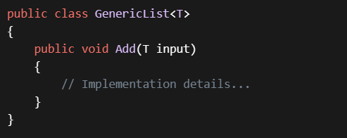

## Generic Classes and Methods:
- Use generic classes and methods to maximize code reuse, type safety, and performance.
- For example, you can create a generic list class that works with various data types without sacrificing type safety or performance:

## Choose Appropriate Type Parameters:
- Select meaningful type parameter names (e.g., T, U, TKey, etc.) to improve code readability.
- Avoid using overly generic names like T1, T2, etc.

## Avoid Non-Generic Collections:
- Prefer using generic collections (e.g., List<T>, Dictionary<TKey, TValue>, etc.) over non-generic ones (e.g., ArrayList).
- Non-generic collections are maintained for compatibility but are not recommended due to their lack of type safety.
## Custom Generic Types:
Create custom generic types when needed. For instance, you can design your own generalized solutions and design patterns using generics.