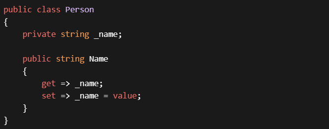
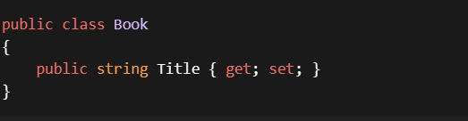
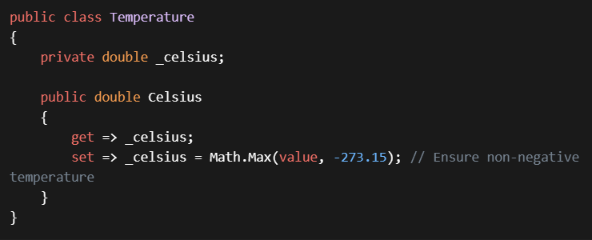

## Understand Properties:
- Properties combine aspects of both fields and methods.
- To the user of an object, a property appears to be a field; accessing the property requires the same syntax.
- To the implementer of a class, a property is one or two code blocks, representing a get accessor and/or a set or init accessor.
Use Explicit Property Declaration:
Explicitly declare properties using the get and set accessors.

Example:

## Auto-Implemented Properties:
For simple properties without additional logic, use auto-implemented properties.
Example:

## Validation and Logic in Accessors:
Use properties to validate data before allowing a change.
Implement custom logic (e.g., range checks, null checks) in the set or init accessor.
Example:

## Avoid Heavy Computation in Accessors:
Avoid slow or resource-intensive logic in property accessors.
Keep properties lightweight and focused on state management.
## Document Property Behavior:
Provide clear documentation for properties, including any validation rules or side effects.
Explain how properties interact with other members of the class.